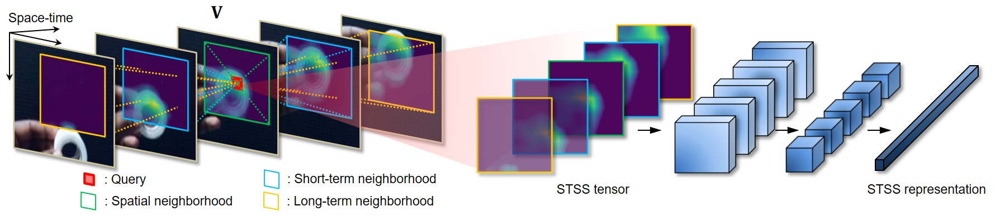

# Learning Self-Similarity in Space and Time as Generalized Motion for Video Action Recognition
***
</img>
***
This is the official implementation of the paper "Learning Self-Similarity in Space and Time as Generalized Motion for Video Action Recognition" by H.Kwon, M.Kim, S.Kwak, and M.Cho.
For more information, checkout the project [website](https://cvlab.postech.ac.kr/research/SELFY/) and the paper on [arXiv](https://arxiv.org/abs/2102.07092).

### Environment:
* Cuda: 9.0
* gcc: 7.3.0
* Python 3.6.8
* PyTorch 1.0.1
* TorchVison: 0.2.2
* Spatial [Correlation Sampler](https://github.com/ClementPinard/Pytorch-Correlation-extension.git)
* Others: [environment.yml](https://github.com/arunos728/SELFY/blob/master/environment.yml)

### Anaconda environment setting

```
git clone https://github.com/arunos728/SELFY.git
cd selfy
conda env create -f environment.yml
conda activate selfy
```

### Installing Correlation sampler

```
cd Pytorch-Correlation-extension
python setup.py install

# check whether SpatialCorrelationSampler is installed correctly.
python check.py forward
python check.py backward
python checkCorrelationSampler.py
```
Please check this [repo](https://github.com/ClementPinard/Pytorch-Correlation-extension) for the detailed instructions.


### Dataset preparation

Please refer to [TSM repo](https://github.com/mit-han-lab/temporal-shift-module) for the detailed data preparation instructions.

File lists (.txt files in [./data](https://github.com/arunos728/SELFY/tree/master/data)) specify configurations of each video clips (path, #frames, class). We upload our Something-Something-V1 & V2 video file lists in [./data](https://github.com/arunos728/SELFY/tree/master/data).
The path of the file lists should be added into the scripts for training (or testing).

### Training & Testing

* For training TSM or MSNet on Something-v1, use the following command:
```bash
    ./scripts/train_SELFY_Something.sh
```

* For testing your trained model on Something-v1, use the following command:
```bash
    ./scripts/test_SELFY_Something.sh
```

### Citation
<!-- If you use this code or ideas from the paper for your research, please cite our paper:
```
@inproceedings{kwon2021learning,
  title={Learning self-similarity in space and time as generalized motion for video action recognition},
  author={Kwon, Heeseung and Kim, Manjin and Kwak, Suha and Cho, Minsu},
  booktitle={Proceedings of the IEEE/CVF International Conference on Computer Vision},
  pages={13065--13075},
  year={2021}
}
``` -->

### Contact
Heeseung Kwon(aruno@postech.ac.kr), Manjin Kim(mandos@postech.ac.kr)

Questions can also be left as issues in the repository. We will be happy to answer them.
